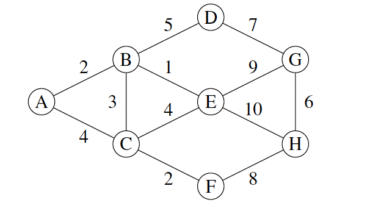

# Written Questions

Complete the following practice questions. You can type your solutions or write and scan them. These are representative of the kinds of questions that might appear on the end-of-sprint quiz.

## Search algorithms

Apply BFS, DFS, and uniform-cost search to the graph above to find paths from A to H.

For each algorithm, draw out its search tree rooted at A. Show the nodes that are created on each level during the search process. Mark nodes with the numbers 1, 2, 3, etc. to indicate which nodes are expanded at each step of the method.

## Anxious Cats

A family of five people and their five cats need to cross the river. Each cat is owned by a different member of the family.

- The boat can only carry up to three people/cats at a time, regardless of size.
- The cats have very high anxiety. No cat can tolerate being with another person unless its owner is present.
- The cats get along fine with each other, so they can be left alone with no humans.
- Any of the humans can operate the boat.
- The first cat, Mittens, has an IQ of 125 and served in the Merchant Marines, where he was trained in piloting river boats. None of the other cats can operate the boat.
- There's no distinction between being in the boat or on shore for the purposes of managing cat anxiety.

1. Define a state representation for this problem, then specify the starting and ending states in your representation. Note that each cat-owner pair is unique, so it's not enough to just keep track of the numbers of cats and owners on each side.

2. Expand the starting state to create the first level of the search tree.

## Branching

Consider a problem with branching factor *b* and a solution that occurs as the last node at depth *d*; that is, the solution is *d* levels below the root at the rightmost search node on that level.

- How many nodes will be *expanded* by a breadth-first search?
- How many nodes willbe *created*? Tip: think about what happens when exploring depth *d*.

How many nodes will be created and expanded by iterative deepening, inclusive of all depths considered during the search? Assume that the method always moves to the leftmost unexplored node on the deepest possible level when choosing the next path to explore.

Suppose that expanding a node takes 1 ms and each node consumes 100 bytes of memory. Calculate the total time and memory requirements of the two searches for a problem with *b* = 100 and *d* = 5. Repeat for a problem with *b* = 5 and *d* = 100.
