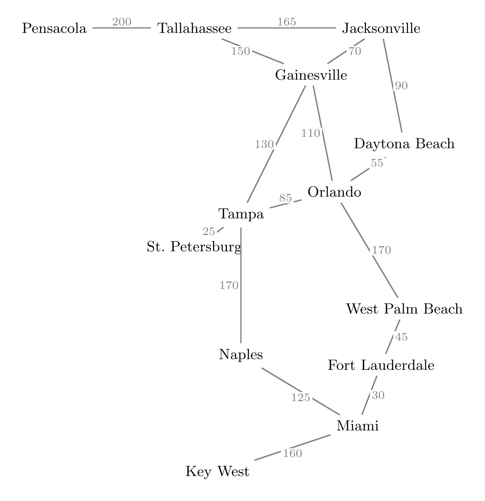

# Uniform-Cost Search


## Overview




Let's return to our earlier example of finding routes between cities in Florida.

So far, we've only considered *finding* a plan - any plan - that achieves the goal state. Our default behavior has been to stop the search process as soon as we reach the goal. For some problems this is sufficient. We've also seen how breadth-first and iterative deepening searches will always find a solution that is the minimum number of state transitions away from the starting state.

Recall, from note #1, that some problems incorporate a `cost` function returns the cost of taking action `a` in state `s`. The cost captures how difficult or expensive a certain action is for the particular state. For the map example, the cost naturally corresponds to the distance between cities; for example, `cost(Gainesville, go to Orlando)` is 110.

If a cost function exists for a problem, we typically want the *minimum cost plan* that minimizes the total cost of the actions taken while moving from the initial state to the goal state.

The **uniform-cost search** modifies the basic algorithm in two ways:

- Keep track of the total cost to reach each node in the search tree. For example, suppose you're considering a state that represents the route Tallahassee-Gainesville-Orlando. The total distance of that route is 240. Call this the *path cost* of the node.

- When expanding nodes, always choose the **node with the lowest path cost**. This requires using a priority queue data structure sorted by path cost, so that popping from the queue always returns the node of minimum value.

### About the name

I dislike criticizing my forebearers in the field, but I hate the name "uniform-cost search".

It's supposed to indicate that all paths of the same cumulative cost are being considered "uniformly"; e.g., all paths of cost = 5 would be considered at the same point in the search before trying more expensive paths. However, the name makes it sound like we're requiring that *the costs themselves be uniform*, which is absolutely not the case.

Better names would be *lowest-cost-first search* or *cheapest-first search*.

## Example search tree

The method needs to keep track of the cumulative total cost for each node in the tree. The root node has a cost of 0.

Suppose that we want to find the shortest path from Orlando to Miami. The first step expands Orlando to create four children with the distances to each:
```
                                (Orlando, 0)
                                      |
      -----------------------------------------------------------------
     |                  |                     |                        | 
(Tampa, 85)    (Gainesville, 110)    (Daytona Beach, 55)    (West Palm Beach, 170)
```
The method chooses the frontier node with the minimum cost, which is Daytona Beach at 55. This opens up a path to Jacksonville with a cumulative cost of 55 + 90 = 145.
```
                                (Orlando, 0)
                                      |
      -----------------------------------------------------------------
     |                  |                     |                        | 
(Tampa, 85)    (Gainesville, 110)    (Daytona Beach, 55)    (West Palm Beach, 170)
                                              |
                                     (Jacksonville, 145)
```
The next node of minimum cost is Tampa at 85. Expanding it creates new nodes for St. Petersburg at a cost of 110 and Naples at 255.
```
                                             (Orlando, 0)
                                                   |
                     -----------------------------------------------------------------
                    |                  |                     |                        | 
               (Tampa, 85)    (Gainesville, 110)    (Daytona Beach, 55)    (West Palm Beach, 170)
                    |                                         |
                    |                               (Jacksonville, 145) 
                    |
          --------------------
         |                    |  
(St. Petersburg, 110)    (Naples, 255)
```
Observe that St. Petersburg and Gainesville have the same cost, so the method will expand both before it considers any higher-cost nodes.

## Optimality

**Uniform-cost search will find the optimal minimum cost solution**, provided that all costs are strictly greater than 0. In this case, the method is essentially the same as Dijkstra's shortest path algorithm applied to the graph of states, where the costs correspond to edge weights.

Note that UCS doesn't care about a node's depth, only its cost. It also only cares about *cumulative cost* up to each point in the search. 

As the example above shows, the method might spend time expanding nodes that are close to the start state, but don't actually move toward the goal. Because you're perceptive you might wonder, "What if we also considered the estimated distance *to* the solution and used that to help pick nodes that are likely to lead in the right direction?"

That turns out to be a very good thing to wonder about, which we'll consider in the next unit.


## Pseudocode

The basic approach shown below should be familiar by this point. This version assumes that the `successors` function calculates the incremental step cost of moving to each successor state and returns its results as a `(state, step cost)` tuple.

```
Uniform Cost Search

input:
    initial state i
    goal state g
    successors function  // returns list of (next state, step cost) tuples

output:
    success if the goal state is reachable, failure otherwise

initialize empty priority queue frontier (ordered by cost, lowest first)

// Begin with the starting state at cost 0
frontier.insert(i, 0)

while frontier is not empty {

    // Choose the state with the lowest cumulative cost
    (x, cost) = frontier.pop_min()

    // If x is the goal state, we're done
    if x == g {
        output success and stop
    }

    // Check if x has already been visited; if so, don't expand it again
    if visited[x] {
        continue
    }

    // We're now visiting x, so mark it
    visited[x] = True

    // Generate successors of x
    s = successors(x)

    // Insert new unvisited successor states into frontier with cumulative cost
    for (j, step_cost) in s {
        if not visited[j] {
            frontier.insert(j, cost + step_cost)
        }
    }
}

// If the loop ends, the state space was exhausted without reaching the goal
output failure and stop
```
