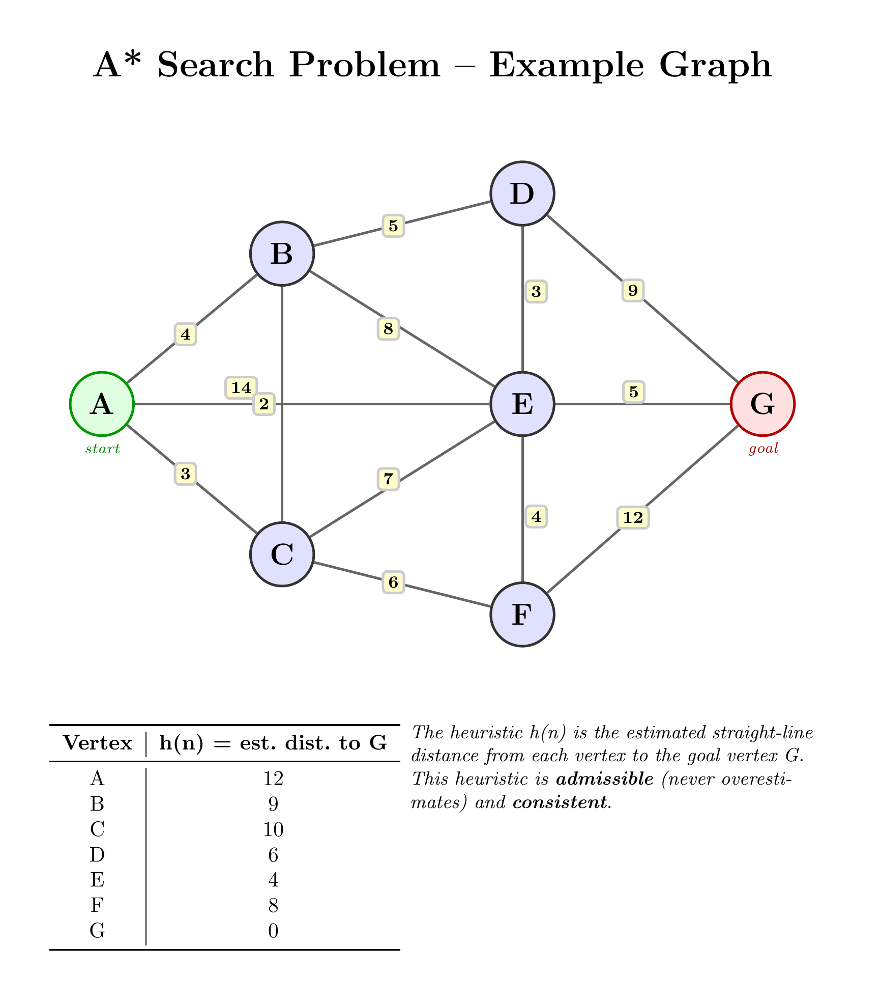

# Sprint 2 Practice Questions

## A*

### Properties

Give concise definitions for each of the following properties:

- A* is *complete*
- A* is *optimal*
- A* is *efficient*

### Admissibility

- Give the mathematical definition of an admissible heuristic

- Explain why the Manhattan distance is an admissible heuristic for the grid-based motion planning problem

- What's another admissible heuristic you could use for the grid-based motion problem?

### Application

Consider the graph above with the given approximate point-to-point heuristic distances.

Suppose that you use A* to find the optimal path from A to G.

- What are the *f*(*n*) values obtained after expanding A on the first iteration?
- What vertex is expanded second?
- What vertex is expanded third?

Finish the search and verify that A* finds the shortest path from A to G.

## Constraint Satisfaction

### Definition

Give a definition for the 3-CNF-SAT problem.

### Test

Is the following formula satisfiable? If so, give an assignment that makes it true.

$$(x_1 \vee x_2 \vee x_3) \wedge (\lnot x_1 \vee \lnot x_2 \vee x_3) \wedge (x_1 \vee x_2 \vee \lnot x_3) \wedge (\lnot x_1 \vee \lnot x_2 \vee \lnot x_3)  \wedge (\lnot x_1 \vee x_2 \vee x_3)$$

### Propagation

Give a concise definition of the concept of constraint propagation.

Summarize the techniques of *literal elimination* and *unit propagation* for the SAT problem.
