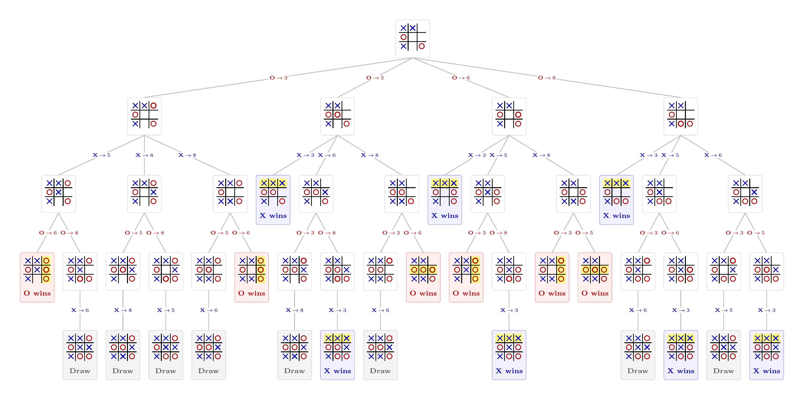

# Adversarial Search

## Overview

Our previous units considered variations on tree search, where the goal was to find a plan that moved from a starting state to a goal state, sometimes under the requirement to find the plan of minimum cost.

We're now going to consider a variation: what if there is an *opponent* who seeks to thwart your moves? Consider a typical turn-based strategic game like tic-tac-toe or chess. You and your opponent alternate moves. On your turn, you always seek the best move; that is, the one that maximizes your chance of winning the game. Your opponent is doing the same from their own perspective - their best move is *your worst move*.

The main algorithm for this unit is the **minimax algorithm** which finds the best move at each step of an adversarial game under the assumption that both players are playing rationally and optimally. That is, I'm trying my best to win on my turn, and my opponent is trying the best to win on his turn.

This set-up leads to a tree of potential moves, alternating turns:

- For the current situation, I have a set of potential moves
- Then my opponent has a set of potential countermoves to each one of my moves
- And I have a set of counter-counter moves in response to his moves
- And so forth, alternating his responses and my responses, until we construct the entire game tree of potential future states

The minimax algorithm tells you how to choose the best top-level move that maximizes your long-term outcome over the entire game, under the assumption that your opponent is making rational responses to maximize *their own* long-term outcome.

## Tic-Tac-Toe

Consider the following tic-tac-toe board, where it's **O's turn** to play next.
```
 O | X | O
-----------
   | X | X
-----------
   | O | X
```
There are two possible moves O can make: the center-left and lower-left. What happens in each case?

- If O takes the center-left square, X takes the lower-left and the outcome is a tie
- If O takes the lower-left, then X wins by completing the middle row

Consider another board for **X's turn**:
```
 X |   | 
-----------
 O |   | 
-----------
 X |   | O
```
Suppose that X takes the top-middle square. We can consider the entire sequence of game moves under that assumption and build the entire tree of potential future game states.



*Image by Claude Opus 4.6. Good bot.*

Observe that O has four possible response moves at the first level of the tree. Three of those give X the option to win immediately by completing the top row, so O will rationally take the upper-left square and block X. This corresponds to the left branch of the game tree, where X will likewise choose the move that blocks O from winning. So, under rational play, the best outcome for X from this move is a *tie*.

### Practice

Repeat the previous example, but choose the top-right for X's move. Show that every one of O's potential countermoves leads to an immediate X win.

## Intuition

The tic-tac-toe example is simple, but illustrates some important concepts for adversarial two-player games:

- First, we should assume that the opponent is rational and will always choose strategically optimal moves. We shouldn't expect to win because the opponent blundered and make a bad move.

- Second, playing out the game tree for each possible move choice can reveal if a move is good or bad. In the example above, the game trees show that the top-right leads to a guaranteed win, so we should choose that move.

Therefore, intuitively, at each step a player should always choose the move that provides the *best outcome*, assuming optimal play from that point forward. You should always assume that your opponent will play rationally and avoid mistakes.

## Scoring outcomes

The minimax algorithm assumes that we can assign a score to each terminating state *from the perspective of the current player*. For tic-tac-toe you could do the following:

- A win for the current player is assigned a score of +1. That is, if it's X's turn to move, then a state where X wins is scored as +1
 
- A loss for the current player is assigned a score of -1. Again, if it's X's turn, then a state where O wins counts for -1

- Ties or incomplete states are assigned 0.

Observe that these scores are symmetric. A finishing state that's +1 for X is worth -1 for O, and vice-versa.

Suppose that I'm playing a game and it's my turn: I always want to choose the move that *maximizes* my score. I want to obtain a +1, or at least a 0 if +1 isn't possible. **From my perspective**, my opponent seeks the *minimum score*: they want to score -1, or 0 if that isn't possble.

### The minimax concept

The driving goal of the minimax algorithm comes from combining scoring with rationality.

_I should always choose the action that maximizes my score, taking account that my opponent will always choose actions to minimize my score._

Consider the tic-tac-toe game tree above, which is drawn from X's perspective as the currently moving player. 

- When it's O's turn, they should rationally choose the move that *minimizes* X's best outcome in the subtree
- X should always prefer the move that *maximizes* their best outcome in the resulting subtree
