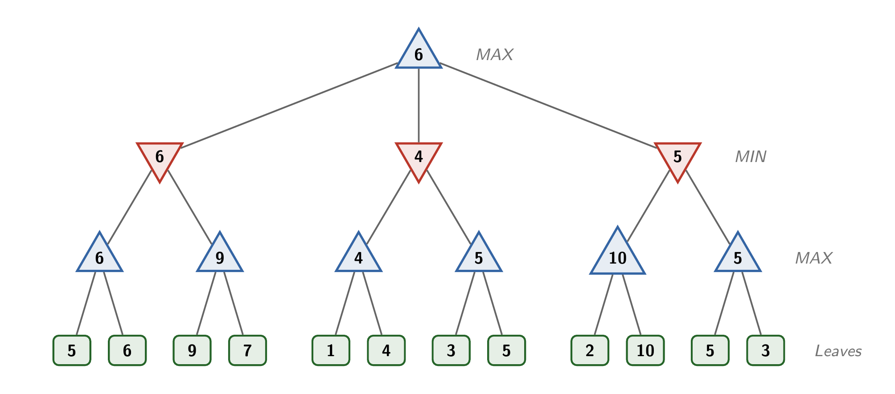

# The Minimax Algorithm

##  An abstract game tree



The previous note described the minimax concept: on my turn, I should choose the move that *maximizes* my score in the resulting game subtree, under the assumption that my opponent will play to *minimize* my score in each subtree.

The image above shows an **abstract game tree** illustrating the minimax concept. The upward and downward triangles represent move choices made by the maximizing and minimizing player, respectively. The leaves represent outcomes, with scores for each outcome. We don't have to care what the moves or scores represent in this tree, only that it alternates levels of minimizing and maximizing.

Consider the bottom-left subtree, with leaves of 5 and 6. The maximizing player seeks the greatest score, so given a choice between those two outcomes, he'll choose the move that yields 6. Likewise, in the next subtree, he'll compare the two outcomes of 9 and 7 and choose the move yielding 9. The bottom max level shows the best outcome the maximizing player can obtain from each pair of leaves.

The minimizing player will always select the move that yields the minimum score through its subtree, under the assumption that the opponent is playing to maximize. The leftmost branch offer the minimizer a choice of a subtree with a best score of 6, or one with 9: the minimizer chooses the move that will guarantee a 6. The rightmost tree offers choices that lead to outcomes of 10 and 5. The minimizer rationally chooses the 5 option.

At the root, the maximizer chooses from among the three branches, The best choice is the left branch, because it offers the highest score taking into account the minimizer's choices. Therefore, the best outcome the maximizer can obtain in this tree is 6.

## Pseudocode

The minimax algorithm is implemented recursively. The basic strategy is to use a variable `is_max_player` that tracks whether this level of the search corresponds to a minimizing or maximizing player. The method also uses a `depth` parameter to prevent the search from going too long. We'll discuss managing the size of the game tree in more detail later.

```
Minimax Algorithm

minimax(node, depth, is_max_player) {

    // Base case: finishing state or search exhausted
    if depth == 0 or node is a finishing state {
        return score(node)
    }

    // Maximizing choice
    if is_max_player {
        best = -infinity
        for each child of node {
            value = minimax(child, depth - 1, false)
            best = max(best, value)
        }
    }

    // Minimizing choice
    else {
        best = +infinity
        for each child of node {
            value = minimax(child, depth - 1, true)
            best = min(best, value)
        }    
    }

    return best
}
```

## The evaluation function

A naive version of minimax would require playing out *the full game tree* for every possible move to reach and score every terminating state. Unless a game is small, this probably isn't feasible.

The depth-limited version shown above will prevent the search from branching out of control, but there are two issues that need to be considered:

1. What is a good choice for the initial value of `depth`, which determines the number of levels in the tree? There's no fixed rule. In general, you should probably run the deepest possible search that you can without making moves take too long.

2. More seriously, what should we do about incomplete states? If `depth` reaches 0, we probably won't be in a terminal state, so we can't simply score a win or loss.

The *evaluation function* takes a state and returns an approximation of its minimax score. This function allows us to evaluate the quality of incomplete states: a state with a high evaluation is closer to a winning state for the maximzing player, and likewise for low evaluations and the minimizing player.

A standard form for evaluation functions is to take a linear combination of features. For example, in a chess engine, a basic evaluation is the count of remaining pieces on the board (which chess players pretentiously call *material*). Pieces are assigned point value, such as 1 for pawns, 3 for knights, 9 for queens, etc. and the evaluation is determined the number of remaining pieces on each side. For example, from white's perspective:

$$ score_{w} = (pawns_w - pawns_b) + 3(knights_w - knights_b) + \ldots + 9(queens_w - queens_b) $$

More complex versions will consider not just the number of pieces, but also add or remove points for pieces that are in strong positions vs. weak positions. For example, knights are stronger in the center of the board than on the edges and pawns are in a better position when advanced. See [this article](https://chessify.me/blog/chess-engine-evaluation) for more information on chess evaluation design.

In practice, a lot of the work of a real game-playing minimax engine is in designing a good evaluation function that captures the important strategic elements of the game. In recent years, many programs have moved to using neural networks to learn evaluations from data, which was a key element in the AlphaGo program that we'll discuss in a future note.
