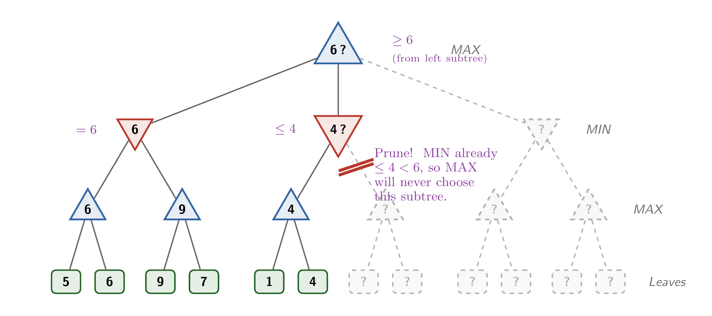
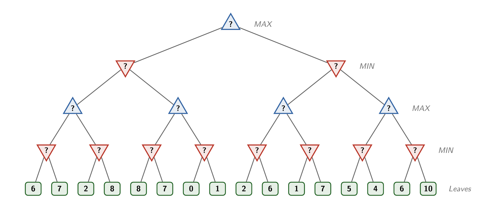
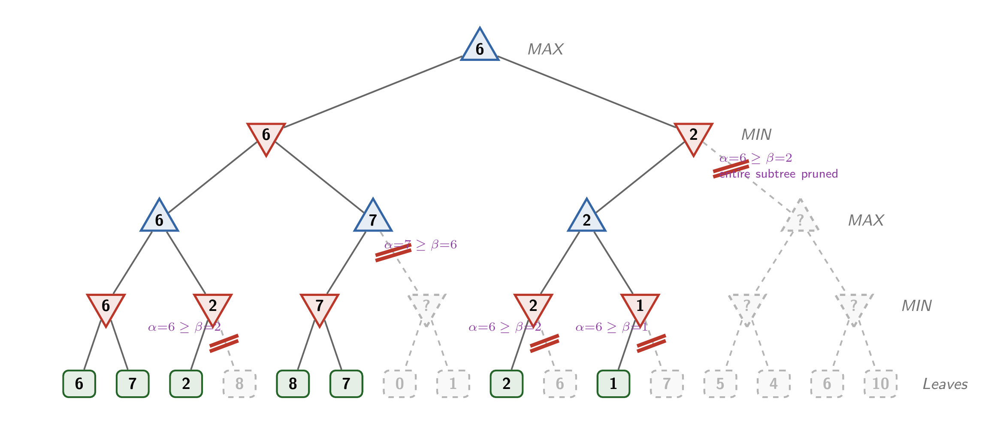

# Alpha-Beta Pruning

## Overview

The vanilla minimax algorithm builds the game tree by expanding all possible moves and counter-moves down to a pre-set maximum depth. A good evaluation function helps estimate the quality of moves when the depth is too shallow to play out the full tree, but this procedure might still end up generating an impractically large number of nodes.

However, it's often possible to speed up the search by **pruning** subtrees that can provably never affect the result. The main pruning algorithm for minimax is **alpha-beta pruning**.

## Example



The figure above shows the abstract game tree from the previous note in a partially complete state. Observe the following:

- The left subtree has been evaluated, yielding a value of 6 through its min node

- The root node is therefore guaranteed to achieve a result of **at least** 6 through its left subtree. There might be a better result available through one of the other subtrees - we don't know yet!

- The central subtree is partially evaluated. The min node there has identified a value of 4 through its left subtree. Therefore, this node is guaranteed a result of **at most** 4. There might be a lower value available through the other subtree, but the min node won't select it yields a value lower than 4.

Now think about the relationship between the root and the cental min node. The root wants to maximize and is guaranteed at least 6, via the result from its left subtree. The central min node will return **at most**, so the root is guaranteed to reject its value. Therefore, *there's no reason to explore the second subtree of the central branch.*

## Algorithm

The example illustrates one half of the pruning strategy:

- When processing a min node, keep track of the best values known to its ancestor max nodes

- Once the min node identifies a result *less than* the best result known by any of its higher-level max nodes, it can stop exploring subtrees and return immediately. In our example, the min node identified a value of 4, which was less than the 6 known to a higher-level max node, so the min node is guaranteed to return a result that won't be accepted.

Max nodes use the same strategy with the roles of the nodes reversed. For every max node, keep track of the best results known to its ancestor min nodes. When a max node identifies a result *greater than* the best results known to its higher-level min nodes, then it can stop exploring subtrees and return immediately. The max node is therefore guaranteed to return a result that won't be accepted by the min node.

The **alpha-beta pruning** algorithm keeps track of two parameters as it builds the game tree. For each node,

- `alpha` is the largest result identified by any higher-level max node on the path to the root
- `beta` is the smallest result identified by any higher-level min node on the path to the root

It may be helpful to think of `alpha` as the max player's current best known result. It would be good (for the max player) if it can continue to identify even larger values that represent better outcomes, but `alpha` represents the lower bound that it's guaranteed to achieve even if no more nodes are explored. Likewise, `beta` is the current estimate of the min player's best outcome.

For a max node, return immediately once you have identified a score ≥ `beta`. This represents a result that will always be rejected by the min player because it isn't competitive with the best known result.

For a min node, like the one in the example, return immediately if you identify a score ≤ `alpha`. Again, this represents a value that is no better than what the max player can already obtain.

## Bigger example



Fill in the abstract game tree above. Work out which subtrees should be pruned. Process the subtrees from left to right.

### Solution



## Example

Here's an updated version of the subtraction game that uses alpha-beta pruning.

```
# The Subtraction Game with Alpha-Beta pruning
# DSM, 2017

# Beginning with a pile of 21 stones, players alternate removing stones until
# none are left. On her turn, a player may take 1, 2, or 3 stones. The player
# who takes the last stone is the winner.

# Change this line to control who goes first
human_moves_first = True

def minimax(stones, depth, alpha, beta, is_max_player):

    """
    Execute the minimax algorithm by exploring the subtree, identifying the
    move at each level that yields the best outcome for its player

    Returns: 
        the best score that the player can obtain in this subtree
        the move yielding that best score
    """

    # If there are no stones left, this player has lost
    # If the max player has lost, return -1 (worst outcome for max)
    # If the min player has lost, return 1 (best outcome for max)
    if stones == 0:
        if is_max_player:
            return -1, 0
        else:
            return 1, 0

    # If the depth limit has been reached, return 0
    if depth == 0:
        return 0, None

    if is_max_player:
        best_value = -10
        best_remove = None

        for remove in [1, 2, 3]:
            value, response = minimax(stones - remove, depth - 1, alpha, beta, False)

            if value > best_value:
                best_value = value
                best_remove = remove

            # Max player quits on finding a value >= beta
            if value >= beta:
                break

            alpha = max(alpha, value)

    if not is_max_player:
        best_value = 10
        best_remove = None

        for remove in [1, 2, 3]:
            value, response = minimax(stones - remove, depth - 1, alpha, beta, True)

            if value < best_value:
                best_value = value
                best_remove = remove

            # Min player quits on finding a value <= alpha
            if value <= alpha:
                break

            beta = min(beta, value)


    return best_value, best_remove


def get_move(stones):
    looping = True;

    while looping:
        looping = False

        print('Remove 1, 2, or 3 stones: ', end='')
        remove = int(input())

        if remove < 1 or remove > 3:
            print('You can only take 1, 2, or 3.')
            looping = True

    return remove


def play():

    stones = 21

    playing = True
    turn = 0

    if human_moves_first:
        turn_index = 0
    else:
        turn_index = 1

    while playing:

        print('')
        print(stones)

        # Human move
        if turn % 2 == turn_index:
            remove = get_move(stones)
            stones -= remove

        # Computer move
        else:
            value, remove = minimax(stones, 20, -10, 10, True)
            print ("I'll take %d." % remove)
            stones -= remove

        # The player who took the last stone is the winner
        if stones == 0:
            if turn % 2 == turn_index:
                print('\nMy...failure...DOES NOT COMPUTE.')
            else:
                print('\nWeep, soft human.')

            playing = False    

        turn += 1


if __name__ == '__main__':
    play()
```

