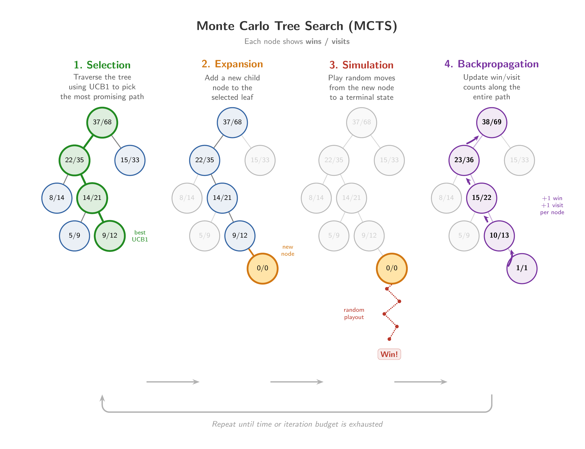

# Monte Carlo Tree Search

*Lee Sedol vs. AlphaGo in 2016. After Deep Blue's defeat of Kasparov, the East Asian game of go emerged as the next major frontier in game-playing AI. Go is played on a 19x19 grid between two players who place white and black stones. The object is to place your stones in a way that captures your opponent's stones and controls the most territory at the end of the game. Go is harder for AI than chess because the branching factor is much higher (there may be hundreds of possible moves at each turn) and because estimating the quality of a move is more difficult. The strategic value of a position may not become clear until many turns later, so standard minimax-based search struggles to identify good moves. Google DeepMind achieved a major breakthrough with the AlphaGo program, which beat top-ranked player Lee Sedol in 2016.*

## Overview

The core problem of classical minimax is the need to expand the (potentially huge) game tree. Even with pruning and evaluation functions, this may be impractical if the game has a high branching factor.

**Monte Carlo Tree Search** (MCTS) is an alternative to minimax that uses *random sampling* to estimate the outcome of paths in the game tree, rather than exhaustive expansion. *Monte Carlo simulation* refers to a general category of algorithms that use samples to estimate complex calculations that would be impossible or inconvenient to evaluate exactly. The name comes from the Monte Carlo casino complex in Monaco.

Intuitively, the method samples random paths through the game tree. Repeatedly play out a full game from root to a leaf (usually by picking random moves on each step) and record the result in the leaf. At the end, pick the top-level move that yielded the highest fraction of wins among its descendant leaves.

If you think about it, this is a variation of the multi-armed bandit problem:

- The top level moves are like arms on the slot machines

- Choosing a particular top-level move and playing out that game gives you information about its effectiveness

- There is an explore vs. exploit tradeoff: you need to test enough to learn whether a branch is good, but you also want to quickly discard unpromising branches

MCTS combines the idea of adversarial tree search with the UCB1 selection strategy from the multi-armed bandit problem. It prioritizes looking deeper in to branches that seem most promising, but with the ability to also investigate less-explored branches to keep the search from over-focusing on one path.

## Algorithm

*Image by Claude*.

 

The MCTS algorithm builds a partial game tree using random sampling. The method begins with only the root node, which represents the current state of the game. As more paths are sampled, nodes will be added to the tree, but in a way that takes advantage of the explore-exploit behavior of UCB1 to prioritize good branches.

The four steps are as follows:

1. Descend the current tree, using UCB1 as the criteria for selecting which move to take at each level.

2. When you reach a node that has remaining unexplored children, pick one at random and add it to the tree. This step grows the tree by one node.

3. Perform a *rollout* of the new child node by playing the game state it represents to completion. This is usually done by making random moves until the game reaches a final state. Note that the rollout step doesn't add new nodes to the tree, it just samples one random path and observes the result.

4. Send the rollout result back up the tree, updating win counts at each node leading up to the root. This provides additional information on the quality of the branches taken in this iteration.

Over time, this method concentrates effort in the best parts of the tree, which end up with more generated child nodes and more rollouts. The method runs until either a time or iteration budget is exhausted.

There are a lot of variations:

- The standard rollout strategy plays out the game by picking random moves, but this may suboptimal for some games like chess. A variation puts more effort into picking reasonable moves at each rollout step, with the tradeoff of making rollouts take longer.

- The standard version almost always adds a new node to the tree on every step. Another option is to cap the number of children a node may have, or make the node-adding step dependent on how many times a node has been visited. A node that's had a proportionally large number of visits may not benefit much by adding more children compared to one that's not yet well-explored.

## AlphaGo

The MCTS algorithm was invented by Rémi Coulom in 2006, who incorporated it into his computer go program named Crazy Stone. This was a breakthrough: Crazy Stone was stronger against professional players than previous go programs

AlphaGo was created by DeepMind, a U.K. AI research startup that was acquired by Google in 2014. It combined the MCTS method of Crazy Stone with neural networks. In 2015, it defeated professional player Fan Hui in a match with no handicap stones.

AlphaGo's main innovations were its two neural networks, called the *value* networks and the *policy* network. They were trained from historical game data, then in simulated play against other copies of AlphaGo.

- The policy network predicts which moves are likely to be successful and is used to guide the descent of the tree during the selection step. The policy network provides a prior probability that helps AlphaGo focus on good moves.

- The value network takes a given board state and directly estimates the probability of winning. It replaces the simulated rollout step with a single forward-pass through the neural net, which is much cheaper, so the model can run more search iterations.

- The version of AlphaGo that beat Sedol also performed rollouts in addition to using the value network. Those rollouts were guided by a *fast rollout* network that balanced choosing good moves against speed. The evaluation of a branch used both the rollout and value network.

DeepMind later improved AlphaGo into **AlphaZero**, which was trained entirely on simulated play against itself, forgoing pre-training on historical data. AlphaZero used only neural evaluations of positions and removed the simulated rollout step.

[See this article](https://research.google/blog/alphago-mastering-the-ancient-game-of-go-with-machine-learning/) for more details on AlphaGo.

