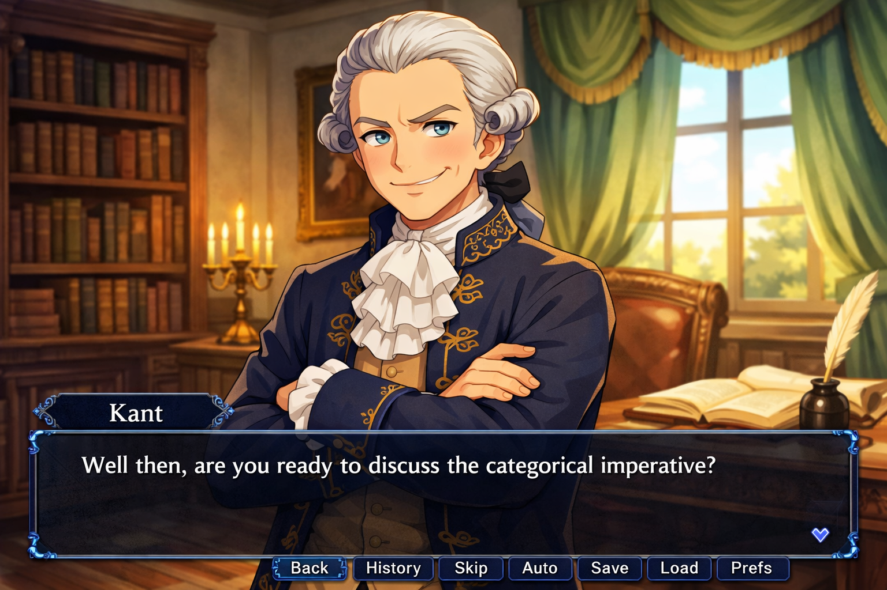
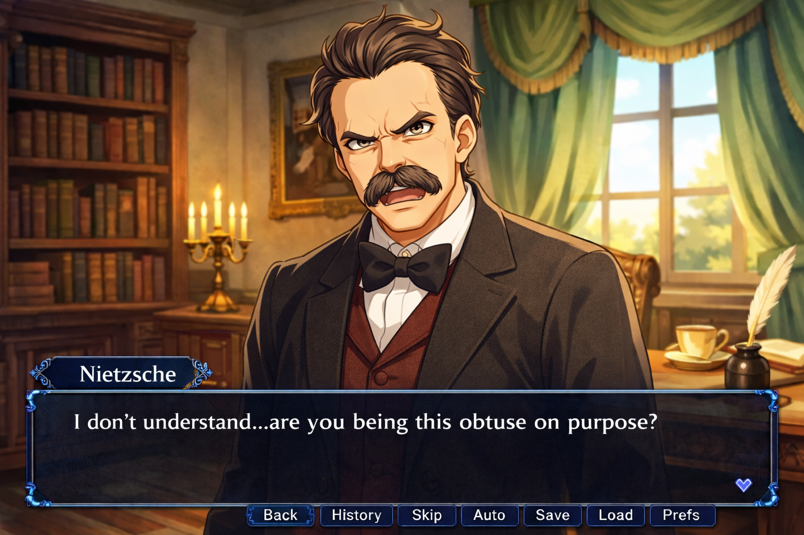
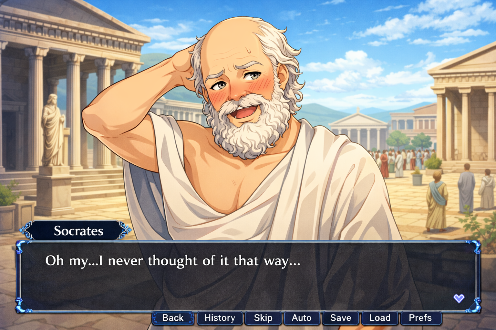

# Philosophy Chatbot

*Kant-senpai and other images created with GPT-5.2*.

## Due on or before 3/13 (the last day of class before Spring Break)

## Overview

In this project you will build a conversational AI application that simulates a dialogue with a historical philosopher. The philosopher will guide the student user through a discussion of their major ideas, drawing directly from their written works — but will do so in character, as a personality you have created based on your understanding of their work.

This project will allow you to practice the following concepts:

- Building a **retrieval-augmented generation (RAG) system**, including encoding chunks, chunk sizing, and using a vector database
- Designing a *state machine* that drives the topic, flow of conversation, and the philosopher's tone
- Prompt engineering an LLM to generate responses driven by the current model state
- Building a visual front-end that also reflects your character's state
- Creating a character design grounded in textual evidence

## Description

You will build a system, implemented as a web application, that simulates a conversation with a historical philosopher about their ideas and works. Your application will have a front-end that displays a static image of the philosopher, their current text, and has an input for the user's response.

The back-end has four major components:

1. A vector database that stores chunked text pieces from the philosopher's works. When it's time to construct a response, the system pulls relevant text chunks and adds them to the response-generation prompt. The technique of prompting an LLM with additional context drawn from a database is called retrieval-augmented generation (RAG) and is a fundamental technique for building AI systems.

2. A state machine that tracks the flow of the conversation. It manages the current topic of discussion, the student's level of understanding within that topic, and the philosopher's in-character mood and response style. As the user inputs answers, the state can change, which represents an evolution of the conversation.

3. An LLM-based text classifier that takes a user input and maps it to one of a small number of categories. The text classifications are used to drive transitions in the state machine.

4. A response generator that takes the last user input, the current state, and any RAG context and creates a prompt. An LLM then uses the prompt to create the character's next response.

## Selecting texts

You may choose any philosopher or thinker whose primary works are available in the public domain. Good sources include Project Gutenberg and the Internet Classics Archive. There are *many* possible choices, for example, Plato, Aristotle, Kant, Karl Marx, John Locke, Friedrich Nietzsche, and Mary Wollstonecraft.

For the thinker that you select, you should be able to choose works totaling at least 10,000 words, and then identify at least **four major concepts** discussed in those works. These ideas will become the major topics of the conversation.

## Crafting the character

Once you've chosen your philosopher, create a **character document** (about 750 words) that describes his or her personality, rhetorical style, values, and characteristic ways of engaging with ideas. This document becomes the foundation of the system prompt used in your generation LLM call.

When designing the persona, consider: How does this philosopher ask questions? Are they patient or provocative? Do they use irony? What ideas do they find most important, most absurd, most dangerous? How do they respond to ignorance — with warmth, with challenge, with humor? Your interpretation should be based on actual evidence from their writing. Your character document should include some textual evidence justifying your choices.

### An important disclaimer

It's important to clarify that you are creating a *character*, a fictional intepretation of a real person.

We can't really know, after all, what Socrates was like, whether Nietzsche had a sense of humor (probably not), or whether Kant was actually good at explaining his own ideas. Historians do agree, though, that [Kierkegaard](https://en.wikipedia.org/wiki/S%C3%B8ren_Kierkegaard) was a total bishōnen.

Many companies have created "chat with a historical person" apps, and they are usually somewhere between cringe and grotesque. Your philosopher is a **construction** — an interpretation that *you've created* based on your understanding of their work. There is precedent for [interpreting historical figures dramatically](https://www.youtube.com/watch?v=xkfvg1j1yg8) for entertainment or education.

Rather than pretending to be an objective discussion with the real historical person, we're embracing creativity to motivate you to engage more deeply with your chosen author's works.

## The vector database

Start by doing some background reading on RAG. [Here's a good starting overview](https://www.pinecone.io/learn/retrieval-augmented-generation/).

The basic building blocks of an RAG system are a **text encoder** and a **vector database**.

The encoder takes chunks of text and turns them into vectors in a high-dimensional abstract *latent space*. The abstract vector representation of a text is called its *embedding*. The embedding captures the underlying meaning of the text chunk, and does so in a way that reflects relationships among texts:

- Similar texts map to the same region of latent space
- Distances between vectors correspond to distances between concepts
- [Directions in latent space represent conceptual relationships](https://www.youtube.com/shorts/FJtFZwbvkI4).

A vector database is a just a database optimized to store and retrieve numeric vectors. In particular, it allows you to quickly search for nearest neighbors of a given input vector.

The basic RAG flow starts by chunking and then encoding the source material. The chunk size is a key parameter, so you'll want to do some research about choosing a good value. Then, given a query,

- Convert it to a vector
- Search the database for similar vectors
- Retrieve their associated text chunks from the database
- Incorporate that text into the LLM prompt

### Tools

I recommend using [ChromaDB](https://docs.trychroma.com/docs/overview/getting-started) as your database. You can install it locally. Use [sentence-transformers](https://github.com/huggingface/sentence-transformers) for embedding. Work with Claude to build a minimal viable example to practice working with these tools before you continue with the rest of the project.

## State machine

The heart of your application is a state machine that tracks the structure of the conversation and drives the philosopher's behavior. The state has three components:
- Topic: the philosophical concept or passage currently under discussion. The topic determines what is retrieved from the vector database. You must define a topic graph with at least four nodes (concepts from the work) and meaningful edges between them.

- Stage — the current mode of engagement within a topic. You must implement at least the following four stages:
  - Introduction: the philosopher raises the topic and orients the student
  - Examination: the philosopher probes the student's understanding through questions
  - Challenge: the philosopher introduces tension, a counterargument, or a harder question
  - Resolution: the conversation arrives at a conclusion, or deliberately rests in productive uncertainty

  Stage progression within a topic is roughly sequential, but transitions may be triggered early or late by the student's responses.

- Tone — the philosopher's current affective or rhetorical register. You must define at least four tone states (examples: warm, probing, skeptical, delighted, disappointed, playful) and specify how tone transitions are triggered. Tone should reflect both the philosopher's fixed character and the dynamics of the current conversation.

The full state at any moment is the combination of topic × stage × tone.

## Two-step LLM pipeline

Each conversational turn must be handled by two sequential LLM calls.

- **Classification**. The user's input is evaluated and classified into one of a small, fixed set of response categories. You can choose the categories you think are useful, but here are some ideas that you should probably support:

  - Demonstrates understanding
  - Expresses confusion
  - Offers a surprising or insightful response
  - Asks a clarifying question
  - Gives a minimal or evasive answer
  - Off-topic or anachronistic input

  The classification result is used by the state machine to determine any transitions before the response is generated. This call should use a minimal, focused prompt. Its output must be a structured, inspectable value — not free text.

- **Generation**. Given the current state (topic, stage, tone), the classification result, the retrieved RAG passages, and the conversation history, the philosopher generates their next response in character.

Note that these must be two separate LLM calls. You can't use one call to both classification and generation!

### Tools

Use the **OpenAI API**. I will send you a key by class e-mail for an account that I've created with some credits for you to use.

Make sure to use good key management. You'll probably want to put it in a `.env` file and load it at the start of your program. Don't upload the key to GitHub or post it in a public workspace.

### Exception handling

You must define a strategy for handling off-topic and anachronistic inputs. This is a character design problem as much as an engineering one. How would your philosopher deflect a question about something they could not possibly know? How do they return the conversation to the work? Your exception state(s) should be consistent with the persona you have designed, and your character document should explain your choices.

## Visual front-end

Build a graphical front-end as a web page that presents the philosopher as a visual character in a scene. The appearance should be connected to the philosopher's current tone, as determined by the state model.

At minimum, you must implement a different visual representation of the philosopher for each tone state. Discuss your choices in your character document. You can choose any visual style or represenation you think is appropriate.

## Questions

#### How broadly is "philospher" defined? Do I have to choose a well-known Western European figure?

Pretty broadly. You are welcome to go outside the standard European/Ancient Greek/Enlightenment tradition if you'd like. You could choose a figure from economics, politics, history, or the arts, as long as they're known for having influential ideas about their area.

I do request, however, that you not choose an explicitly religious figure.

#### Do I have to use AI-generated images?

You can, but it's not required. You can create any visual style or artwork that you want.

#### Do I have to use the visual novel style?

No, you can pick any presentation that you want. There's lots of room for creativity here, so think about interesting options.

#### What happens at the end?

You can add an "End" state to your model that's reached if the user successfully transitions through all the topics.

#### How hard should it be?

Again, you can choose how much depth and understanding you want to require for each topic, but I recommend making it something where the user can observe some progress with a few minutes of play.

## Submission

Demo your project for me in person. I may ask you questions about your approach, your character design, and your code. 

You will also write a short reflective summary (about 500 words) of your experience developing the project, what you think succeeded and failed, and what this has helped you understand about the strengths and limitations of LLMs.

Once I've approved your project, you'll upload your character document, reflection, and application code to Canvas.
