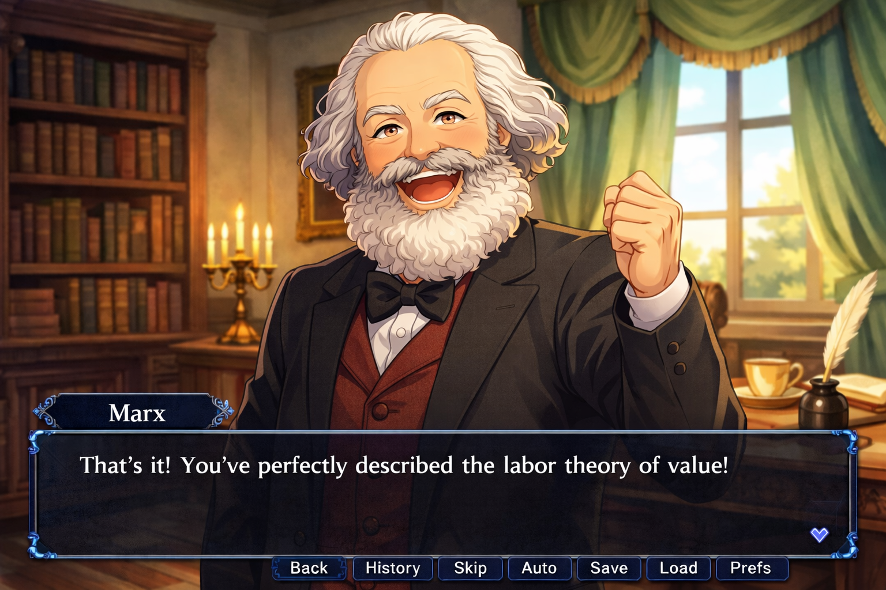

# Philosophy and RAG

*Kant-senpai, notice my philosophy!*

## Overview

In this project you will build a conversational AI application that simulates a dialogue with a historical philosopher. The philosopher will guide the student user through a discussion of their major ideas, drawing directly from their written works — but will do so in character, as a personality you have created based on your understanding of their work.

This project will allow you to practice the following concepts:

- Building a **retrieval-augmented generation (RAG) system**, including encoding chunks, chunk sizing, and using a vector database
- Designing a *state machine* that drives the topic, flow of conversation, and the philosopher's tone
- Prompt engineering an LLM to generate responses driven by the current model state
- Building a visual front-end that also reflects your character's state
- Creating a character design grounded in textual evidence

## Description

You will build a system, implemented as a web application, that simulates a conversation with a historical philosopher about their ideas and works. Your application will have a front-end that displays a static image of the philosopher, their current text, and has an input for the user's response.

The back-end has four major components:

1. A vector database that stores chunked text pieces from the philosopher's works. When it's time to construct a response, the system pulls relevant text chunks and adds them to the response-generation prompt. The technique of prompting an LLM with additional context drawn from a database is called retrieval-augmented generation (RAG) and is a fundamental technique for building AI systems.

2. A state machine that tracks the flow of the conversation. It manages the current topic of discussion, the student's level of understanding within that topic, and the philosopher's in-character mood and response style. As the user inputs answers, the state can change, which represents an evolution of the conversation.

3. An LLM-based text classifier that takes a user input and maps it to one of a small number of categories. The text classifications are used to drive transitions in the state machine.

4. A response generator that takes the last user input, the current state, and any RAG context and creates a prompt. An LLM then uses the prompt to create the character's next response.

## Selecting texts

You may choose any philosopher or thinker whose primary works are available in the public domain. Good sources include Project Gutenberg and the Internet Classics Archive. There are *many* possible choices, for example, Plato, Aristotle, Kant, Karl Marx, John Locke, Friedrich Nietzsche, and Mary Wollstonecraft.

For the thinker that you select, you should be able to choose works totaling at least 10,000 words, and then identify at least **three major concepts** discussed in those works. These ideas will become the major topics of the conversation.

## Crafting the character

Once you've chosen your philosopher, create a **character document** (about 750 words) that describes his or her personality, rhetorical style, values, and characteristic ways of engaging with ideas. This document becomes the foundation of the system prompt used in your generation LLM call.

When designing the persona, consider: How does this philosopher ask questions? Are they patient or provocative? Do they use irony? What ideas do they find most important, most absurd, most dangerous? How do they respond to ignorance — with warmth, with challenge, with humor? Your interpretation should be based on actual evidence from their writing. Your character document should include some textual evidence justifying your choices.

### An important disclaimer

It's important to clarify that you are creating a *character*, a fictional intepretation of a real person.

We can't really know, after all, what Socrates was really like, whether Nietzsche had a sense of humor (probably not), or whether Kant was actually good at explaining his own ideas. Historians do agree, though, that [Kierkegaard](https://en.wikipedia.org/wiki/S%C3%B8ren_Kierkegaard) was an S-tier bishōnen.

Many companies have created "chat with a historical person" apps, and they are usually somewhere between cringe and grotesque. Your philosopher is a construction — an interpretation that *you've created* based on your understanding of their work. Rather than pretending to be an objective discussion with "the real" historical person, we're embracing creative interpretation to motivate you to engage more deeply with your chose author's works.

## Components

## 
